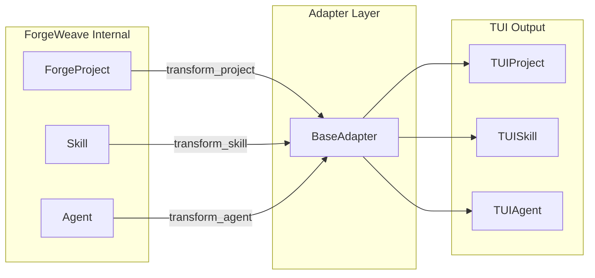
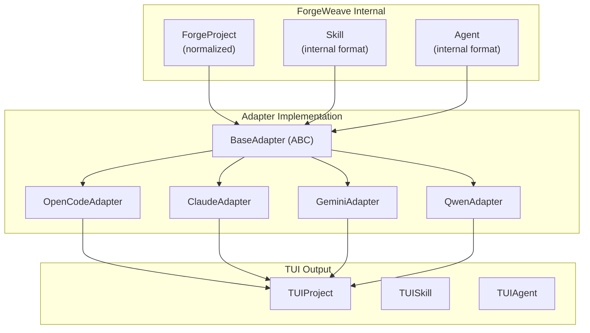
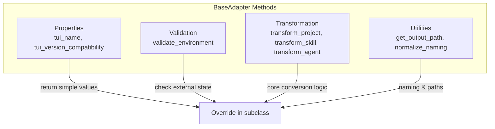
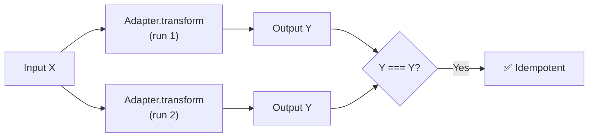
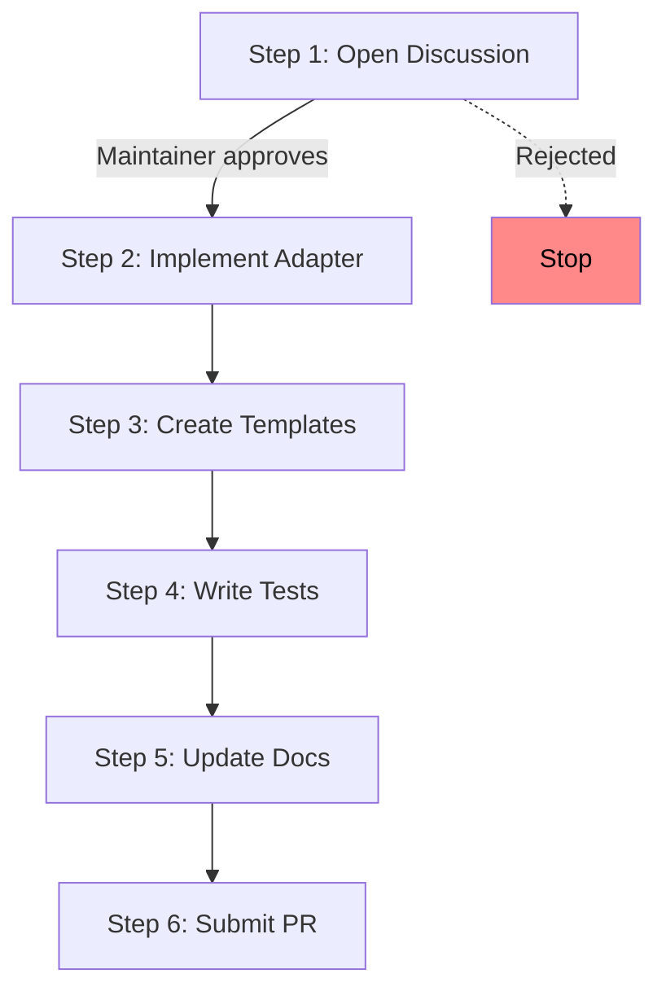
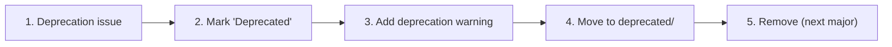

# Adapter Specification Standard

**Version:** 1.0
**Status:** Active
**Last updated:** 2026-06-22

> **v2 Note:** ForgeWeave 2.0 does not have a runtime adapter engine or BaseAdapter class. Adapters are implemented as template directories (`src/forgeweave/templates/<tui>/`) with TUI-specific file structures. This spec documents the logical adapter rules that template authors must follow.

This document defines how ForgeWeave TUI adapters must be implemented. Adapters are strict transformation boundaries between the ForgeWeave internal format and TUI-specific formats.

> **IMPORTANT:** An adapter that violates these rules will be rejected. Adapters are the outermost layer — bugs here affect all users of a given TUI.

---

## Table of Contents

- [What is an Adapter?](#what-is-an-adapter)
- [Architecture](#architecture)
- [Supported Adapters](#supported-adapters)
- [Base Interface](#base-interface)
- [Adapter Rules](#adapter-rules)
- [File Structure](#file-structure)
- [Adding a New Adapter](#adding-a-new-adapter)
- [Adapter Deprecation Policy](#adapter-deprecation-policy)

---

## What is an Adapter?

An Adapter converts ForgeWeave's internal, normalized structures into the format expected by a specific TUI (Terminal UI / coding environment).



### Adapter Characteristics

| Property | Description |
|---|---|
| **Transformation-only** | They convert, not compute |
| **Stateless** | They hold no runtime state between transformations |
| **Isolated** | Business logic must never live inside an adapter |
| **Versioned** | Adapters track compatibility with their target TUI |

### What an Adapter Is NOT

- **Not** a business logic container
- **Not** a skill loader
- **Not** an agent runner
- **Not** a configuration manager

---

## Architecture



---

## Supported Adapters

| Adapter Class | Target TUI | Status |
|---|---|---|
| `OpenCodeAdapter` | OpenCode |  |
| `ClaudeAdapter` | Claude Code |  |
| `GeminiAdapter` | Gemini CLI |  |
| `QwenAdapter` | Qwen Code |  |

---

## Base Interface

Every adapter must implement the `BaseAdapter` abstract class:

```python
from abc import ABC, abstractmethod
from forgeweave.core.types import ForgeProject, TUIProject

class BaseAdapter(ABC):
    """Abstract base class for all ForgeWeave TUI adapters.

    All adapters must implement every method defined here.
    No method may be left as a pass-through without explicit documentation.
    """

    @property
    @abstractmethod
    def tui_name(self) -> str:
        """The canonical TUI name. Must match the key in PROJECT_CONTEXT.md."""
        ...

    @property
    @abstractmethod
    def tui_version_compatibility(self) -> str:
        """Minimum compatible TUI version (semver string)."""
        ...

    @abstractmethod
    def validate_environment(self) -> AdapterValidationResult:
        """Check that the target TUI is installed and meets minimum version.

        Returns:
            AdapterValidationResult with is_valid flag, version found, and
            any warnings or errors encountered.
        """
        ...

    @abstractmethod
    def transform_project(self, project: ForgeProject) -> TUIProject:
        """Convert a ForgeProject into the TUI's expected directory structure.

        Args:
            project: A fully validated ForgeProject instance.

        Returns:
            A TUIProject instance representing the target structure.

        Raises:
            AdapterTransformError: If transformation cannot be completed.
        """
        ...

    @abstractmethod
    def transform_skill(self, skill: Skill) -> TUISkill:
        """Convert a ForgeWeave Skill into the TUI's skill format.

        Args:
            skill: A validated Skill instance.

        Returns:
            A TUISkill instance in the target format.

        Raises:
            AdapterTransformError: If the skill format is incompatible.
        """
        ...

    @abstractmethod
    def transform_agent(self, agent: Agent) -> TUIAgent:
        """Convert a ForgeWeave Agent into the TUI's agent format.

        Args:
            agent: A validated Agent instance.

        Returns:
            A TUIAgent instance in the target format.

        Raises:
            AdapterTransformError: If the agent format is incompatible.
        """
        ...

    @abstractmethod
    def get_output_path(self) -> Path:
        """Return the root path where this TUI expects its configuration.

        Example: OpenCode uses `.opencode/`, Claude uses `.claude/`.

        Returns:
            A Path object representing the TUI's config root directory.
        """
        ...

    @abstractmethod
    def normalize_naming(self, name: str) -> str:
        """Convert a ForgeWeave internal name to the TUI's naming convention.

        Args:
            name: A ForgeWeave internal identifier (always kebab-case).

        Returns:
            The name in the format expected by this TUI.
        """
        ...
```

### Method Classification



---

## Adapter Rules

### Rule 1: No Business Logic in Adapters

Adapters transform. They do not decide, validate, or compute. If you are writing conditional logic beyond naming transformation in an adapter, it belongs in the core layer.

```python
# WRONG — business logic in adapter
class ClaudeAdapter(BaseAdapter):
    def transform_skill(self, skill):
        if skill.depth == "deep":  # business logic
            skill.steps.append(extra_step)
        return self._convert(skill)

# RIGHT — pure transformation
class ClaudeAdapter(BaseAdapter):
    def transform_skill(self, skill):
        return ClaudeSkill(
            name=self.normalize_naming(skill.skill_id),
            content=self._render_skill_template(skill),
        )
```

### Rule 2: Adapters Must Be Idempotent



Running an adapter transformation twice on the same input must produce the same output. No timestamps, no random IDs, no side effects.

### Rule 3: Adapters Must Not Modify Input

Input objects passed to adapter methods must not be mutated. Always create new output instances.

```python
# WRONG — mutates input
def transform_skill(self, skill):
    skill.name = self.normalize_naming(skill.skill_id)  # mutation!
    return skill

# RIGHT — creates new instance
def transform_skill(self, skill):
    return ClaudeSkill(
        name=self.normalize_naming(skill.skill_id),
        content=self._render(skill),
    )
```

### Rule 4: Naming Normalization Must Be Documented

Every adapter must document its naming convention in its class docstring and in this specification:

| Adapter | Convention | Example Input | Example Output |
|---|---|---|---|
| OpenCode | `kebab-case` | `deep-research` | `deep-research` |
| Claude | `kebab-case` | `deep-research` | `deep-research` |
| Gemini | `snake_case` | `deep-research` | `deep_research` |
| Qwen | `kebab-case` | `deep-research` | `deep-research` |

> **NOTE:** Update this table when new adapters are added.

### Rule 5: Compatibility Failures Must Be Explicit

If the target TUI is not installed or is below the minimum version, `validate_environment()` must return a clear error message. It must not silently skip validation.

```python
# RIGHT — explicit failure
def validate_environment(self) -> AdapterValidationResult:
    if not self._is_tui_installed():
        return AdapterValidationResult(
            is_valid=False,
            version_found=None,
            errors=["Claude Code is not installed. Visit https://docs.anthropic.com/..."],
        )
```

---

## File Structure for a New Adapter

```
forgeweave/
  adapters/
    <tui_name>.py        # Adapter class implementation
    _base.py             # BaseAdapter (do not modify)
    _types.py            # TUIProject, TUISkill, TUIAgent types

templates/
  <tui_name>/
    skills/              # TUI-specific skill templates
    agents/              # TUI-specific agent templates
    commands/            # TUI-specific command templates
    AGENTS.md            # TUI-specific AGENTS.md template

tests/
  unit/
    test_adapter_<tui_name>.py
  integration/
    test_forge_init_<tui_name>.py
  fixtures/
    <tui_name>/          # Sample TUI output fixtures for assertions
```

---

## Adding a New Adapter



### Step 1: Open a Discussion First

New adapters represent a long-term maintenance commitment. Before writing code, open a GitHub Discussion with:

- The target TUI name and link
- Evidence that the TUI has a stable configuration format
- Your plan for maintaining compatibility as the TUI evolves
- Who will maintain this adapter long-term

### Step 2: Implement the Adapter

Create `forgeweave/adapters/<tui_name>.py` implementing all `BaseAdapter` methods. See the existing adapters for reference patterns.

### Step 3: Create the Template Directory

Populate `templates/<tui_name>/` with at minimum:
- One example skill
- One example agent
- An `AGENTS.md` template
- A `README.md` explaining TUI-specific behavior

### Step 4: Write Tests

Minimum test coverage for a new adapter:

- Unit tests for each `transform_*` method with valid inputs
- Unit tests for each `transform_*` method with invalid inputs (should raise `AdapterTransformError`)
- Unit test for `validate_environment()` with TUI present and absent
- Integration test: run `forge init --tui <tui_name>` against a test project and assert the output directory structure matches fixtures

### Step 5: Update Documentation

- Add the adapter to the table in this document
- Add the TUI to the supported environments list in `PROJECT_CONTEXT.md`
- Add the adapter to the supported adapters list in `README.md`
- Update `CHANGELOG.md`

### Step 6: Submit the PR

Follow the standard [CONTRIBUTING.md](./CONTRIBUTING.md) PR process. Tag the PR with the `new-adapter` label.

---

## Adapter Deprecation Policy

When a TUI is no longer actively maintained:



1. Maintainer opens an issue proposing deprecation with evidence of TUI abandonment.
2. The adapter is marked `Deprecated` in `PROJECT_CONTEXT.md` and this document.
3. A deprecation warning is added to the adapter class.
4. After one full minor release cycle, the adapter is moved to `forgeweave/adapters/deprecated/`.
5. After one full major release cycle, the adapter is removed.
