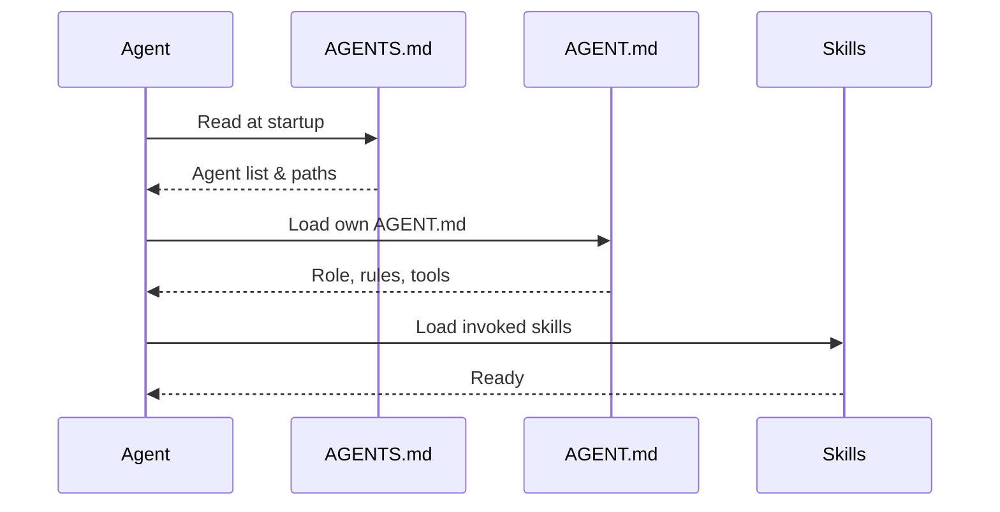

# AGENTS.md

**Version:** 1.0
**Last updated:** 2026-06-15
**Status:** Active

This file registers and configures all agents available in a ForgeWeave project. It is loaded by every agent at initialization time to understand the project's capabilities.

> **IMPORTANT:** Agents must not modify this file directly. Configuration changes must go through the `forge` CLI or a maintainer-approved PR.

---

## How It Works



Every agent reads this file during initialization (see [AGENT_SPEC.md](./AGENT_SPEC.md) — Lifecycle > Initialization). The file tells the agent:

- Which agents are available in this project
- Where to find each agent's `AGENT.md` specification
- Whether each agent is currently enabled

---

## Format

Agents are registered in YAML format:

```yaml
agents:
  - id: <agent-id>
    path: <relative-path-to-AGENT.md>
    enabled: true | false
```

### Field Reference

| Field | Type | Required | Description |
|---|---|---|---|
| `id` | string | Yes | Agent ID, must match `agent_id` in the AGENT.md frontmatter |
| `path` | string | Yes | Relative path from project root to the agent's `AGENT.md` file |
| `enabled` | boolean | Yes | Whether this agent is active. `false` means the agent exists but will not be loaded |

---

## Registered Agents

| Agent ID | Path | Status |
|---|---|---|
| *(none yet)* | — | Agents are defined per-project via `forge init` |

> **NOTE:** To register a new agent, run `forge init` or manually add an entry following the format above.

---

## Validation Rules

The following checks are performed when this file is loaded:

| Rule | Behavior on failure |
|---|---|
| File exists and is valid YAML | Hard error — agent loading halts |
| All required fields present (`id`, `path`, `enabled`) | Hard error |
| `id` matches an existing AGENT.md `agent_id` | Hard error |
| `path` points to an existing file | Hard error |
| No duplicate agent IDs | Hard error |
| `enabled` is a boolean | Warning — treats as `false` |

---

## Example

```yaml
agents:
  - id: planner-agent
    path: templates/opencode/agents/planner-agent/AGENT.md
    enabled: true

  - id: researcher-agent
    path: templates/opencode/agents/researcher-agent/AGENT.md
    enabled: true

  - id: reviewer-agent
    path: templates/opencode/agents/reviewer-agent/AGENT.md
    enabled: false
```
