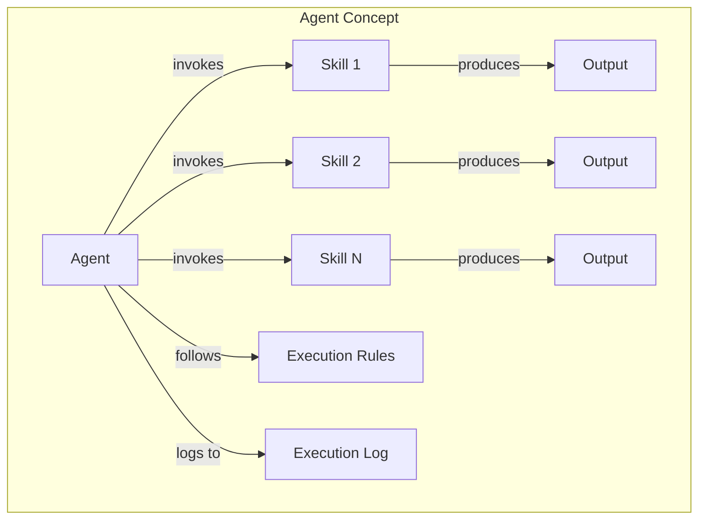
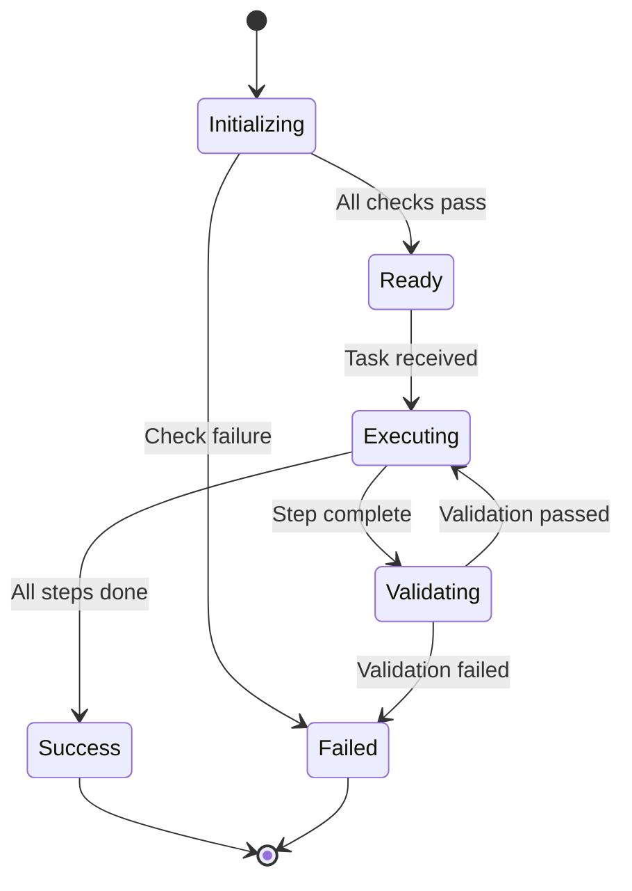
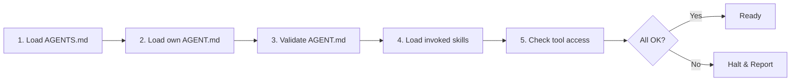
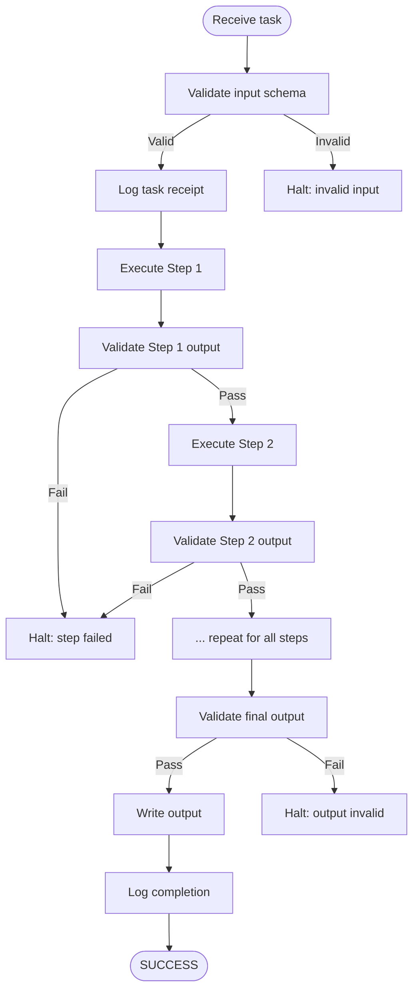
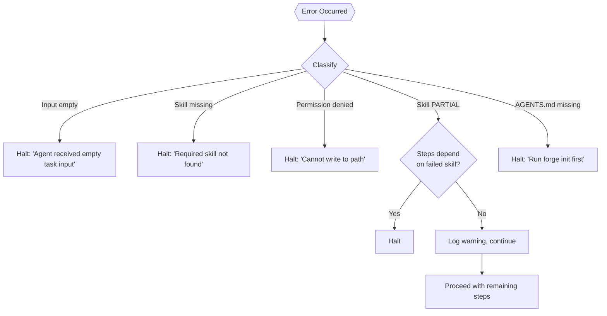
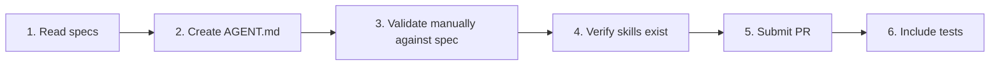

# Agent Specification Standard

**Version:** 1.0
**Status:** Active
**Last updated:** 2026-06-22

> **v2 Note:** ForgeWeave 2.0 generates AGENT.md files as TUI-consumed templates. There is no runtime Agent Engine — agents are loaded and executed by the TUI (OpenCode, Claude Code, etc.). This spec defines the canonical format that all AGENT.md files must follow for compatibility across TUIs.

This document defines the canonical format for all ForgeWeave agents. Every agent — core or community-contributed — must conform to this specification.

> **CAUTION:** An agent that does not conform to this spec will not be loaded correctly by TUI agent runners. Validation is strict by design.

---

## Table of Contents

- [What is an Agent?](#what-is-an-agent)
- [File Location](#file-location)
- [Naming Conventions](#naming-conventions)
- [Complete AGENT.md Template](#complete-agentmd-template)
- [Lifecycle](#lifecycle)
- [Error Handling](#error-handling)
- [Validation Rules](#validation-rules)
- [Agent Interaction Rules](#agent-interaction-rules)
- [Submitting a New Agent](#submitting-a-new-agent)

---

## What is an Agent?

An Agent is an **autonomous worker** that executes structured workflows by invoking skills, following rules, and producing traceable outputs.



### Agent Characteristics

| Property | Description |
|---|---|
| **Role-specific** | Each agent has exactly one defined role |
| **Rule-bound** | Behavior is fully determined by its AGENT.md |
| **Lifecycle-aware** | Defined start, execute, and stop conditions |
| **Transparent** | No hidden tool access, no undocumented side effects |

### What an Agent Is NOT

- **Not a Skill** — skills are invoked *by* agents
- **Not a Command** — commands *trigger* agents
- **Not a general-purpose assistant** — agents have narrow, defined roles
- **Not stateful** — agents hold no state between separate task invocations

---

## File Location

Every agent file must be placed at:

```
templates/<tui-name>/agents/<agent-name>/AGENT.md
```

### Examples

| TUI | Path |
|---|---|
| OpenCode | `templates/opencode/agents/planner-agent/AGENT.md` |
| Claude Code | `templates/claude/agents/researcher-agent/AGENT.md` |
| Gemini CLI | `templates/gemini/agents/builder-agent/AGENT.md` |
| Qwen Code | `templates/qwen/agents/reviewer-agent/AGENT.md` |

---

## Naming Conventions

| Element | Convention | Example |
|---|---|---|
| Directory name | `kebab-case`, always ends in `-agent` | `planner-agent` |
| File name | Always `AGENT.md` | `AGENT.md` |
| Agent name in frontmatter | `Title Case` | `Planner Agent` |
| Agent ID | `kebab-case` | `planner-agent` |

---

## Complete AGENT.md Template

Every AGENT.md must contain all sections listed below, in this exact order.

```markdown
---
agent_id: <kebab-case-id>
name: <Human Readable Name>
version: <semver, e.g. 1.0.0>
description: <One sentence. What this agent does and why it exists.>
author: <GitHub username or "ForgeWeave Core">
tui_compatibility:
  - opencode
  - claude
  - gemini
  - qwen
tags:
  - <tag>
---

# <Agent Name>

## Role

One clear sentence defining this agent's singular responsibility.
An agent should be describable in one sentence. If it takes more, split it into multiple agents.

This agent is responsible for <specific responsibility>.

## Goals

2-5 measurable goals this agent pursues when active.
Goals must be specific enough that success or failure is verifiable.

1. Goal one.
2. Goal two.
3. Goal three.

## Non-Goals

Explicitly state what this agent does NOT do.
This prevents scope creep and clarifies boundaries for contributors and users.

- This agent does not <excluded responsibility>.
- This agent does not <excluded responsibility>.

## Tool Access

Declare every tool and permission this agent is allowed to use.
Any tool not listed here is FORBIDDEN.
If an agent needs a tool not in this list, the spec must be updated via PR first.

### Permitted Tools

| Tool | Permission | Purpose |
|---|---|---|
| `forge.memory.read` | Read-only | Access project context |
| `forge.skill.invoke` | Execute | Invoke skills defined in the skills directory |
| `file.read` | Read-only, project directory only | Read project files |
| `file.write` | Write, output directory only | Write results |

### Forbidden Operations

- This agent must not invoke other agents directly. Orchestration is handled by the pipeline layer.
- This agent must not make network requests without explicit user configuration.
- This agent must not write outside the project directory.
- This agent must not modify `AGENTS.md` or any ForgeWeave configuration files.

## Invoked Skills

List all skills this agent may invoke. Skills must exist in the template directory.

| Skill ID | When invoked |
|---|---|
| `deep-research` | When topic research is required |
| `code-review` | When output code needs validation |

## Execution Rules

The behavioral rules this agent follows during execution.
These are invariants — they must hold true throughout the agent's lifecycle.
Rules are checked at each step boundary.

1. The agent must read `AGENTS.md` before beginning any task.
2. The agent must log every decision point with its reasoning.
3. The agent must not proceed past a failed step without explicit handling.
4. The agent must not assume intent — if the task is ambiguous, request clarification.
5. The agent must not skip validation steps even when inputs appear correct.

## Input Schema

The exact schema of inputs this agent accepts.

```json
{
  "task": "string (required) — description of what the agent should accomplish",
  "context": "object (optional) — additional project context",
  "depth": "enum: surface | standard | deep (optional, default: standard)",
  "output_path": "string (optional) — override default output location"
}
```

## Output Schema

### Output Location

```
./<tui>/agents/<agent-id>/output/<timestamp>-<task-slug>/
```

### Output Files

| File | Contents |
|---|---|
| `result.md` | Primary output in Markdown format |
| `execution-log.json` | Step-by-step execution log with timestamps |
| `status.json` | Final status: SUCCESS, PARTIAL, or FAILED |

### status.json Schema

```json
{
  "agent_id": "string",
  "task": "string",
  "status": "SUCCESS | PARTIAL | FAILED",
  "started_at": "ISO 8601 timestamp",
  "completed_at": "ISO 8601 timestamp",
  "steps_completed": "integer",
  "steps_total": "integer",
  "failure_reason": "string | null"
}
```

## Constraints

- This agent must not run for more than `<X> minutes` without producing a progress update.
- This agent must not hold more than `<Y> MB` of data in memory at once.
- This agent must treat all file paths as untrusted input and validate before use.
- This agent must not execute code contained in task inputs.

## Examples

### Example 1: Standard Task Invocation

**Input:**
```json
{
  "task": "Research the MCP protocol specification and summarize key concepts",
  "depth": "standard"
}
```

**Expected status.json:**
```json
{
  "agent_id": "researcher-agent",
  "task": "Research the MCP protocol specification and summarize key concepts",
  "status": "SUCCESS",
  "started_at": "2026-01-15T09:30:00Z",
  "completed_at": "2026-01-15T09:34:22Z",
  "steps_completed": 4,
  "steps_total": 4,
  "failure_reason": null
}
```

## Changelog

| Version | Change |
|---|---|
| 1.0.0 | Initial version |
```

---

## Lifecycle



### Initialization

When the agent starts, the following sequence runs. If any step fails, the agent halts immediately.



1. Load `AGENTS.md` from the project root.
2. Load its own `AGENT.md` and validate it against this spec.
3. Load all skills listed in the Invoked Skills section.
4. Confirm all required tools are accessible.
5. If any initialization step fails: report the failure and halt.

### Execution Flow



### Stopping Conditions

#### Success Conditions

The agent stops successfully when:

1. All execution steps have completed without error.
2. Output has been validated against the output schema.
3. Output has been written to the declared output location.
4. Completion has been logged.

#### Failure Conditions

The agent stops with failure when:

1. Input validation fails (missing required fields, invalid types).
2. A skill invocation returns a FAILED status.
3. A required tool is unavailable.
4. A file write operation fails.
5. Any execution rule is violated.

On failure, the agent must:

- Log the failure with step number, error details, and current state.
- Preserve any partial output in a `.partial/` subdirectory with the failure reason.
- Report the failure to the invoking command or pipeline.
- Never retry automatically — retries require explicit user instruction.

---

## Error Handling



| Error Condition | Agent Response |
|---|---|
| Task input is empty | Halt. Report: `"Agent received empty task input."` |
| Required skill not found | Halt. Report: `"Required skill '<skill-id>' not found. Cannot execute."` |
| File write permission denied | Halt. Report: `"Cannot write to '<path>'. Check permissions."` |
| Skill returns PARTIAL status | Log warning. Continue if remaining steps are independent of failed skill output. Otherwise halt. |
| AGENTS.md not found | Halt. Report: `"AGENTS.md not found in project root. Run 'forge init' first."` |

---

## Validation Rules

The ForgeWeave agent validator checks the following at load time:

| Rule | Behavior on failure |
|---|---|
| `agent_id` matches directory name | Hard error — agent will not load |
| All required frontmatter fields present | Hard error |
| All required sections present | Hard error |
| All invoked skills exist in templates | Hard error |
| Stopping conditions define both success and failure | Hard error |
| Tool access section is not empty | Hard error |
| `tui_compatibility` is not empty | Hard error |

> **WARNING:** Validation errors are hard by design. An agent with an invalid configuration is a security and determinism risk.

---

## Agent Interaction Rules

These rules govern how agents relate to each other and to the broader system:

1. **No direct agent-to-agent calls.** Agents cannot invoke other agents. Only the orchestration layer (future: pipeline engine) coordinates multi-agent workflows.
2. **No shared mutable state.** Agents cannot read or write each other's output directories during concurrent execution.
3. **No assumption of execution order.** Unless explicitly coordinated by a pipeline, agents must be designed to run independently.
4. **Single responsibility.** If an agent's role cannot be described in one sentence, it should be split.

---

## Submitting a New Agent



1. Read this entire specification and the [SKILL_SPEC.md](./SKILL_SPEC.md).
2. Create the agent in the appropriate template directory.
3. Validate your AGENT.md manually against the Validation Rules table above. *(A `forge validate` command is planned for a future release.)*
4. Ensure all skills listed in Invoked Skills exist and pass validation.
5. Submit a PR following the [CONTRIBUTING.md](./CONTRIBUTING.md) process.
6. PR must include at least one integration test demonstrating the agent's success and failure paths.
