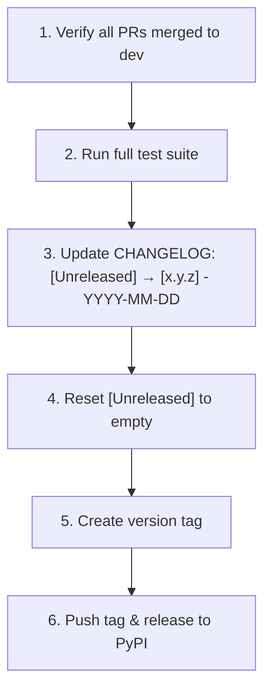

# Changelog

All notable changes to ForgeWeave are documented in this file.

  
  

---

## How to Update This File

- All contributors **must** update this file in every PR under the `[Unreleased]` section.
- Use the correct category for your change (see below).
- Write entries from the **user's perspective**, not the implementer's.

| Good | Bad |
|---|---|
| "Skills with malformed output format sections now raise a clear validation error instead of silently skipping" | "Refactored SkillLoader internal parse method" |

### Categories

| Category | When to use |
|---|---|
| `Added` | New features, commands, adapters, skills, agents |
| `Changed` | Changes to existing behavior (non-breaking) |
| `Deprecated` | Features that will be removed in a future release |
| `Removed` | Features that have been removed |
| `Fixed` | Bug fixes |
| `Security` | Security fixes or hardening changes |

---

## [Unreleased]

> Changes that are merged into `dev` but not yet released.

### Added

- Initial project structure and architecture definition (`PROJECT_CONTEXT.md`).
- Contributor documentation: `CONTRIBUTING.md`, `CODE_OF_CONDUCT.md`, `SECURITY.md`, `CHANGELOG.md`.
- GitHub issue templates: Bug Report, Feature Proposal, Adapter Request.
- GitHub PR template with contributor checklist.
- Skill Specification Standard (`SKILL_SPEC.md`).
- Agent Specification Standard (`AGENT_SPEC.md`).
- Adapter Specification Standard (`ADAPTER_SPEC.md`).
- Project-level agent registration config (`AGENTS.md`).
- Pre-commit configuration (`.pre-commit-config.yaml`).

### Fixed

- Corrected relative paths in spec documents to point to actual file locations.
- Fixed `main.py` template path resolution bug.

---

## [0.1.0] — TBD

> First public release. Core scaffolding and CLI foundation.

| Category | Details |
|---|---|
| **CLI** | `forge init` command with interactive TUI selector |
| **Specs** | SKILL_SPEC.md, AGENT_SPEC.md, ADAPTER_SPEC.md — all v1.0 |
| **Docs** | CONTRIBUTING.md, CODE_OF_CONDUCT.md, SECURITY.md, PROJECT_CONTEXT.md |
| **Templates** | `.github/` issue and PR templates |
| **Infrastructure** | pyproject.toml, uv.lock, .python-version, .pre-commit-config.yaml |

*(Detailed changelog entries will be populated at first release.)*

---

### Release Checklist for Maintainers

---

<!--
VERSIONING RULES FOR MAINTAINERS:

PATCH (0.1.x): Bug fixes, documentation corrections, test additions.
MINOR (0.x.0): New features that are backward-compatible (new commands, new adapters, new skills).
MAJOR (x.0.0): Breaking changes (CLI interface changes, template format changes, adapter API changes).

To release:
1. Move all [Unreleased] entries to a new versioned section with today's date.
2. Reset [Unreleased] to empty.
3. Tag the release in Git: git tag -a v0.x.x -m "Release v0.x.x"
-->
