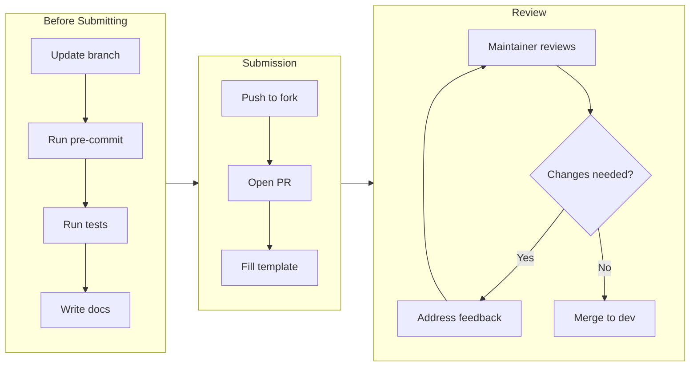

# Contributing to ForgeWeave

Thank you for your interest in ForgeWeave. This document is the single source of truth for how contributions are made, reviewed, and merged. Read it fully before opening an issue or pull request.

ForgeWeave is a **behavioral execution framework for AI agents inside development environments** — not a general-purpose tool. Every contribution must preserve that core identity.

---

## Table of Contents

1. [Code of Conduct](#code-of-conduct)
2. [Before You Start](#before-you-start)
3. [Project Philosophy](#project-philosophy)
4. [Development Setup](#development-setup)
5. [Project Structure](#project-structure)
6. [Branching Strategy](#branching-strategy)
7. [Commit Message Standard](#commit-message-standard)
8. [Types of Contributions](#types-of-contributions)
9. [Pull Request Process](#pull-request-process)
10. [Review Standards](#review-standards)
11. [Testing Requirements](#testing-requirements)
12. [Documentation Requirements](#documentation-requirements)
13. [What Will Be Rejected](#what-will-be-rejected)
14. [Getting Help](#getting-help)

---

## Code of Conduct

All contributors are expected to follow the [CODE_OF_CONDUCT.md](./CODE_OF_CONDUCT.md). Violations are taken seriously and handled directly by maintainers.

The short version: be direct, be respectful, be useful. Toxicity, passive aggression, and bad faith contributions are not tolerated.

---

## Before You Start

> **Do not open a pull request without first doing one of the following.**

For **bug fixes or small improvements:**
- Search existing [GitHub Issues](https://github.com/Razaib-khan/forgeweave/issues) to confirm the bug hasn't already been reported or fixed.
- If no issue exists, open one using the Bug Report template.

For **new features or architecture changes:**
- Open a [GitHub Discussion](https://github.com/Razaib-khan/forgeweave/discussions) or an issue using the Feature Proposal template.
- Wait for maintainer acknowledgment before writing any code.
- PRs submitted without prior discussion for non-trivial features will be closed without review.

For **documentation improvements:**
- These can be submitted directly as a PR without prior discussion.

---

## Project Philosophy

ForgeWeave operates on a strict set of principles. Before contributing, internalize these — they are non-negotiable and will be enforced at review time.

### Determinism over Creativity
System logic must produce the same output given the same input. No random behavior, no hidden branching, no undocumented side effects.

### Explicit over Implicit
If behavior is not documented, it does not exist. Every decision in the codebase must be traceable to a documented rule.

### Template-Driven Generation
All project scaffolding is generated from versioned templates. No hardcoded generation logic outside the template system.

### No Hidden State
Agents and skills must declare what they read and write. State passed between modules must be explicit and logged.

### Adapters Are Boundaries
Each TUI adapter (OpenCode, Claude, Gemini, Qwen) is a strict transformation boundary. Business logic must never leak into adapters.

---

## Development Setup

### Prerequisites

| Requirement | Minimum Version |
|---|---|
| Python | 3.11+ |
| pip | 23.0+ |
| Git | 2.40+ |
| Virtual environment | `venv` or `poetry` |

### Step-by-step

```bash
# 1. Fork the repository on GitHub, then clone your fork
git clone     https://github.com/Razaib-khan/forgeweave.git
cd forgeweave

# 2. Add the upstream remote
git remote add upstream https://github.com/Razaib-khan/forgeweave.git

# 3. Create a virtual environment
python -m venv .venv
source .venv/bin/activate        # On Windows: .venv\Scripts\activate

# 4. Install dependencies (including dev dependencies)
pip install -e ".[dev]"

# 5. Install pre-commit hooks
pre-commit install

# 6. Verify setup
forge doctor
```

> **Note:** The `forge doctor` command is not yet implemented. It will verify your environment in a future release.

If `forge doctor` passes all checks, your environment is correctly configured.

---

## Project Structure

```text
forgeweave/
├── forgeweave/               # Core Python package
│   ├── cli/                  # CLI entry points and command routing
│   ├── adapters/             # TUI-specific transformation layers
│   │   ├── opencode.py
│   │   ├── claude.py
│   │   ├── gemini.py
│   │   └── qwen.py
│   ├── skills/               # Skill loading, parsing, validation
│   ├── agents/               # Agent lifecycle and execution logic
│   ├── templates/            # Template engine and versioning
│   ├── hooks/                # Lifecycle hook system (future)
│   ├── mcp/                  # MCP integration layer (future)
│   └── core/                 # Shared types, config, constants
├── templates/                # Static TUI template blueprints
│   ├── opencode/
│   ├── claude/
│   ├── gemini/
│   └── qwen/
├── tests/                    # All tests mirror the package structure
│   ├── unit/
│   ├── integration/
│   └── fixtures/
├── docs/                     # Extended documentation
├── .github/                  # GitHub Actions, issue templates, PR templates
├── CONTRIBUTING.md
├── CODE_OF_CONDUCT.md
├── SECURITY.md
├── CHANGELOG.md
├── PROJECT_CONTEXT.md
├── pyproject.toml
└── README.md
```

---

## Branching Strategy

ForgeWeave uses a simplified trunk-based model.

| Branch | Purpose |
|---|---|
| `main` | Stable, release-ready code only |
| `dev` | Active development, base for all PRs |
| `feature/<name>` | New features (branch from `dev`) |
| `fix/<issue-number>-<short-desc>` | Bug fixes (branch from `dev`) |
| `docs/<topic>` | Documentation changes |
| `chore/<task>` | Tooling, CI, dependency updates |

### Rules

- **Never push directly to `main`.**
- All PRs must target `dev`, not `main`.
- `main` is only updated through releases by maintainers.
- Branch names must follow the naming convention above — PRs with non-conforming branch names will be asked to rename before review.

---

## Commit Message Standard

ForgeWeave follows [Conventional Commits](https://www.conventionalcommits.org/en/v1.0.0/).

### Format

```
<type>(<scope>): <short description>

[optional body]

[optional footer(s)]
```

### Types

| Type | When to use |
|---|---|
| `feat` | New feature or capability |
| `fix` | Bug fix |
| `docs` | Documentation changes only |
| `refactor` | Code restructure without behavior change |
| `test` | Adding or updating tests |
| `chore` | Build tooling, CI, dependency updates |
| `perf` | Performance improvement |
| `revert` | Reverting a previous commit |

### Scope (optional but encouraged)

Use the module name: `cli`, `adapter`, `skills`, `agents`, `templates`, `core`, `mcp`

### Examples

```bash
feat(cli): add `forge validate` command for schema checking

fix(adapter): resolve naming collision in ClaudeAdapter template mapping

docs(skills): update SKILL.md specification with output format section

test(agents): add unit tests for agent lifecycle state machine
```

### Rules

- Subject line: 72 characters max, present tense, no period at end.
- If the commit fixes an issue, add `Closes #<issue-number>` in the footer.
- Squash fixup commits before submitting a PR.

---

## Types of Contributions

### Bug Fixes

- Must include a test that reproduces the bug before the fix.
- Must include the test passing after the fix.
- Reference the issue number in the PR.

### New Features

- Must be discussed and approved via issue/discussion first.
- Must include documentation in `/docs` and inline docstrings.
- Must include tests covering happy path, edge cases, and failure modes.
- Must not break any existing adapter compatibility.

### New Adapters

- Must implement the full `BaseAdapter` interface.
- Must include an adapter-specific template directory under `/templates/<tui-name>/`.
- Must include integration tests against the new TUI's expected output format.
- Must be documented in `PROJECT_CONTEXT.md` under the supported environments section.

### New Skills

- Must follow the [SKILL_SPEC.md](./SKILL_SPEC.md) format exactly.
- Placed in `/templates/<tui>/skills/`.
- Must include a description, execution steps, constraints, and output format.

### New Agents

- Must follow the [AGENT_SPEC.md](./AGENT_SPEC.md) format exactly.
- Must define role, goals, tool access, execution rules, and stopping conditions.
- No agent may have undocumented side effects.

### Documentation

- Typo fixes, clarity improvements, and new guides are always welcome.
- Do not rewrite existing docs without opening a discussion first — context is often intentional.

---

## Pull Request Process



### Before Submitting

- [ ] Branch is up to date with `dev` (`git fetch upstream && git rebase upstream/dev`)
- [ ] All pre-commit hooks pass locally
- [ ] All existing tests pass (`pytest`)
- [ ] New tests written for new behavior
- [ ] Docstrings added or updated
- [ ] Relevant documentation updated
- [ ] CHANGELOG.md updated under `[Unreleased]`
- [ ] PR title follows Conventional Commits format

### Submitting

1. Push your branch to your fork.
2. Open a PR against `Razaib-khan/forgeweave:dev`.
3. Fill out the PR template completely — incomplete templates will be returned.
4. Link the related issue using `Closes #<number>` or `Related to #<number>`.

### After Submitting

- A maintainer will review within **5 business days** for small PRs, **10 business days** for large ones.
- Respond to review comments within **7 days** or the PR may be closed as stale.
- Do not ping maintainers repeatedly. One polite follow-up after the review window is acceptable.
- If requested changes are made, re-request review explicitly.

---

## Review Standards

All PRs are reviewed against these criteria:

| Criterion | What reviewers check |
|---|---|
| Correctness | Does it do what it claims? Does it handle failures? |
| Determinism | Does the same input always produce the same output? |
| Explicitness | Is all behavior documented and traceable? |
| Test coverage | Are new code paths covered by tests? |
| Adapter safety | Does it break any existing TUI adapters? |
| Spec compliance | Do skills/agents follow their respective specs? |
| Commit quality | Are commits clean, scoped, and conventional? |

Reviewers will leave comments categorized as:

- **[blocking]** — Must be resolved before merge.
- **[suggestion]** — Improvement recommended, not required.
- **[question]** — Asking for clarification, not blocking.
- **[nit]** — Minor style issue, optional to fix.

---

## Testing Requirements

All contributions that touch logic must include tests.

### Structure

Tests live in `/tests/` and mirror the package structure:

```text
tests/
  unit/
    test_cli.py
    test_adapters.py
    test_skills.py
  integration/
    test_forge_init.py
  fixtures/
    sample_skill.md
    sample_agent.md
```

### Running Tests

```bash
# All tests
pytest

# With coverage report
pytest --cov=forgeweave --cov-report=term-missing

# Specific module
pytest tests/unit/test_adapters.py
```

### Coverage Requirement

- Minimum **80% coverage** on new code.
- Core modules (`/forgeweave/core/`, `/forgeweave/cli/`) require **90%+**.
- PRs that drop overall coverage will not be merged.

### Test Rules

- No test may depend on external network calls.
- No test may depend on execution order.
- Use fixtures for shared setup — no copy-pasted setup code.
- Integration tests must clean up after themselves.

---

## Documentation Requirements

Every contribution that changes behavior must update documentation.

| What changed | What to update |
|---|---|
| New CLI command | `docs/cli-reference.md` + inline `--help` text |
| New adapter | `PROJECT_CONTEXT.md` + adapter-specific README |
| New skill | `SKILL_SPEC.md` examples + template |
| New agent | `AGENT_SPEC.md` examples + template |
| Architecture change | `PROJECT_CONTEXT.md` |
| Public API change | Inline docstrings (Google style) |

Docstrings follow [Google Python Style](https://google.github.io/styleguide/pyguide.html#38-comments-and-docstrings):

```python
def load_skill(path: str) -> Skill:
    """Load and validate a skill from a SKILL.md file.

    Args:
        path: Absolute path to the SKILL.md file.

    Returns:
        A validated Skill instance ready for execution.

    Raises:
        SkillValidationError: If the SKILL.md does not conform to the spec.
        FileNotFoundError: If the path does not exist.
    """
```

---

## What Will Be Rejected

The following will result in immediate PR closure without extended review:

- Code that introduces non-deterministic behavior (random outputs, time-dependent logic without mocking).
- PRs that add features without prior discussion (for non-trivial changes).
- PRs submitted against `main` instead of `dev`.
- Any modification of `/config/secure` or destructive file operations without explicit user confirmation in the code.
- Skills or agents that have undocumented side effects.
- Tests that mock the system under test itself.
- Removing or weakening existing test coverage.
- PRs that mix unrelated changes (one concern per PR, always).

---

## Getting Help

- **Questions about the codebase:** Open a [GitHub Discussion](https://github.com/Razaib-khan/forgeweave/discussions).
- **Bug reports:** Open an issue using the Bug Report template.
- **Feature ideas:** Open an issue using the Feature Proposal template.
- **Security issues:** See [SECURITY.md](./SECURITY.md). Do not open public issues for security vulnerabilities.

We appreciate every contribution — but we value quality over quantity. A single well-reasoned, well-tested, well-documented PR is worth ten rushed ones.
