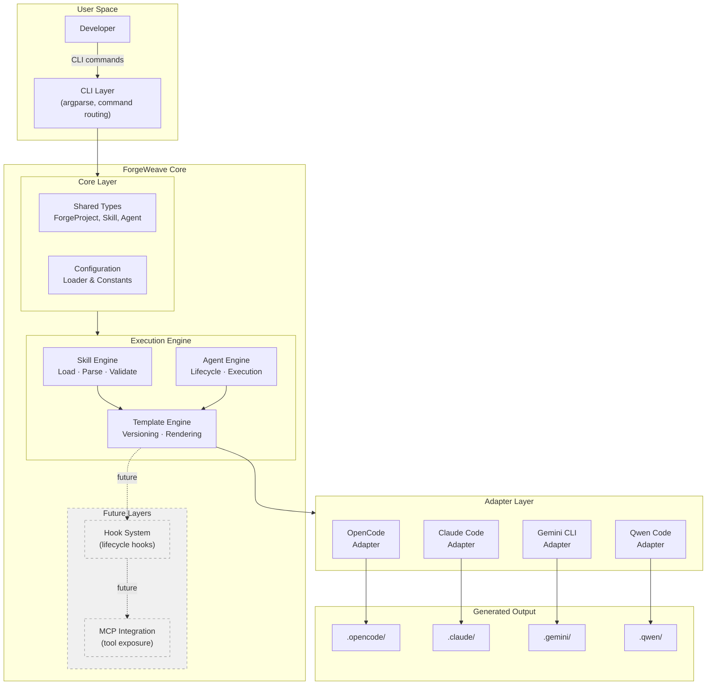
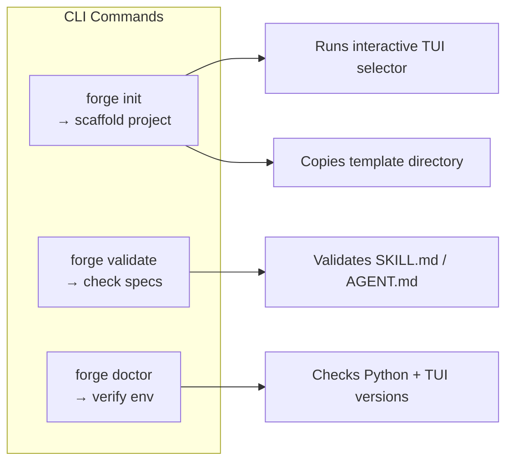
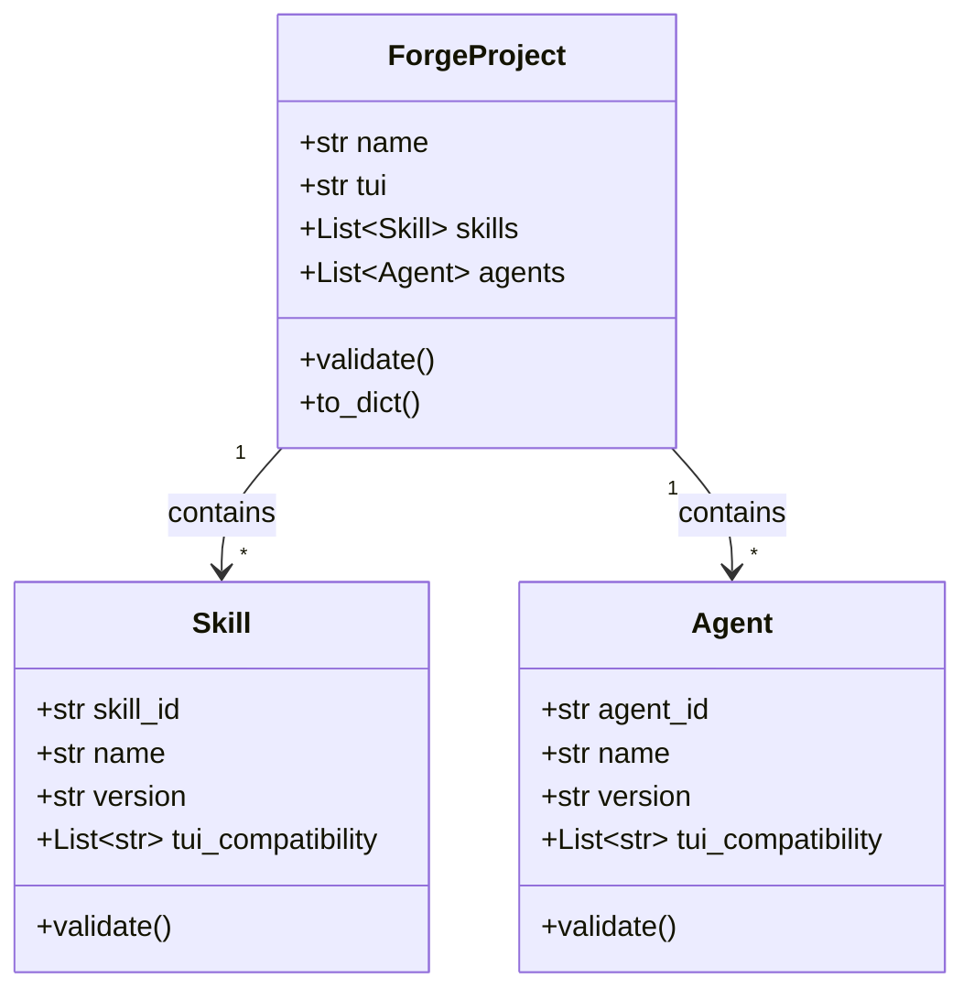
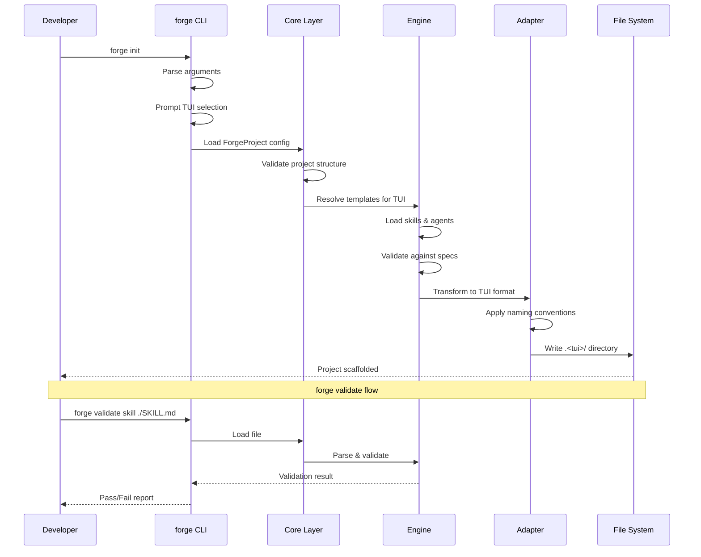
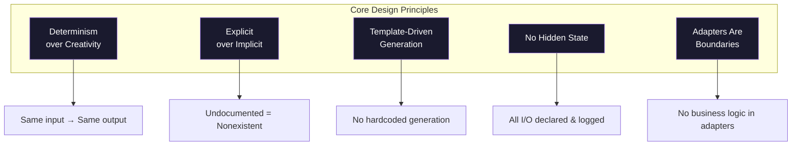
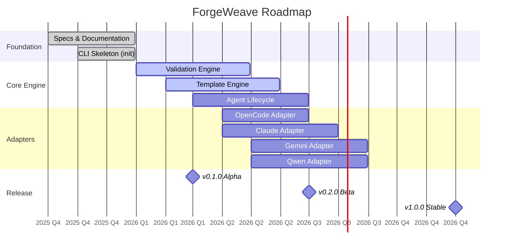

# Project Context

**Version:** 1.0
**Last updated:** 2026-06-15
**Status:** Active

This document provides high-level architectural context for ForgeWeave. It is the reference for design decisions, supported environments, and project scope.

> **IMPORTANT:** This is the source of truth for architecture decisions. Any change to the architecture must be reflected here first.

---

## Table of Contents

- [What is ForgeWeave?](#what-is-forgeweave)
- [Architecture Overview](#architecture-overview)
- [Layer Responsibilities](#layer-responsibilities)
- [Data Flow](#data-flow)
- [Supported Environments (TUIs)](#supported-environments-tuis)
- [Design Principles](#design-principles)
- [Key Specifications](#key-specifications)
- [Project Status](#project-status)
- [Roadmap](#roadmap)
- [Glossary](#glossary)

---

## What is ForgeWeave?

ForgeWeave is a **behavioral execution framework for AI agents inside development environments** (TUIs). It is a CLI tool written in Python that:

1. **Initializes projects** with TUI-specific agent and skill scaffolding.
2. **Defines and enforces** strict specifications for Skills and Agents.
3. **Transforms** internal structures into TUI-specific formats via adapters.
4. **Enforces** determinism, transparency, and explicit behavior documentation.

---

## Architecture Overview

---

## Layer Responsibilities

### CLI Layer

Responsible for command routing, argument parsing, and user interaction.

| Command | Status | Description |
|---|---|---|
| `forge init` | ✅ Implemented | Interactive TUI selector, scaffolds `.opencode/`, `.claude/`, etc. |
| `forge validate` | ❌ Planned | Validates skills and agents against their respective specs |
| `forge doctor` | ❌ Planned | Verifies environment prerequisites |

### Core Layer

Holds shared types, config loading, and constants used across all other layers.

### Skill Engine

Handles skill loading from template directories, parsing SKILL.md frontmatter, and validating against [SKILL_SPEC.md](./SKILL_SPEC.md).

### Agent Engine

Manages agent lifecycle (initialization → execution → stopping), invokes skills, and enforces execution rules defined in [AGENT_SPEC.md](./AGENT_SPEC.md).

### Template Engine

Manages versioned template rendering. Converts internal representations into Markdown files using TUI-specific templates.

### Adapter Layer

Stateless transformation boundary. Each adapter implements `BaseAdapter` and converts ForgeWeave internal structures into TUI-specific formats.

---

## Data Flow

---

## Supported Environments (TUIs)

| TUI | Adapter Class | Status | Config Directory | Naming Convention |
|---|---|---|---|---|
| OpenCode | `OpenCodeAdapter` |  | `.opencode/` | `kebab-case` |
| Claude Code | `ClaudeAdapter` |  | `.claude/` | `kebab-case` |
| Gemini CLI | `GeminiAdapter` |  | `.gemini/` | `snake_case` |
| Qwen Code | `QwenAdapter` |  | `.qwen/` | `kebab-case` |

> **NOTE:** Adding a new TUI requires implementing a new adapter class. See [ADAPTER_SPEC.md](./ADAPTER_SPEC.md) for the full process.

---

## Design Principles

### Determinism over Creativity

System logic must produce the same output given the same input. No random behavior, no hidden branching, no undocumented side effects. This is non-negotiable — contributions that introduce non-determinism will be rejected.

### Explicit over Implicit

If behavior is not documented, it does not exist. Every decision in the codebase must be traceable to a documented rule. This applies to:

- CLI commands and their flags
- Skill execution steps and decision rules
- Agent lifecycle and stopping conditions
- Adapter transformation logic

### Template-Driven Generation

All project scaffolding is generated from versioned templates. No hardcoded generation logic exists outside the template system. This ensures:

- **Consistency** across TUI outputs
- **Versioning** of template formats
- **Auditability** of what was generated

### No Hidden State

Agents and skills must declare what they read and write. State passed between modules must be explicit and logged. Any contribution that introduces implicit state passing will be rejected.

### Adapters Are Boundaries

Each TUI adapter is a strict transformation boundary. Business logic must never leak into adapters. Adapters are:

- **Stateless** — no runtime state between calls
- **Idempotent** — same input → same output every time
- **Non-mutating** — never modify input objects

---

## Key Specifications

| Document | Version | Purpose |
|---|---|---|
| [SKILL_SPEC.md](./SKILL_SPEC.md) | 1.0 | Canonical format for all ForgeWeave skills |
| [AGENT_SPEC.md](./AGENT_SPEC.md) | 1.0 | Canonical format for all ForgeWeave agents |
| [ADAPTER_SPEC.md](./ADAPTER_SPEC.md) | 1.0 | How TUI adapters must be implemented |
| [AGENTS.md](./AGENTS.md) | 1.0 | Project-level agent registration and configuration |

---

## Project Status

ForgeWeave is in **early development** (v0.1.0 pre-release). The core specifications are defined, but the CLI and adapters are not yet fully implemented.

### What's Done

- All three specifications (SKILL_SPEC, AGENT_SPEC, ADAPTER_SPEC) are complete and stable
- Contributor documentation (CONTRIBUTING, CODE_OF_CONDUCT, SECURITY) is in place
- GitHub templates for issues and PRs are configured
- Basic `forge init` CLI command

### What's in Progress

- Template directory population for all 4 TUIs
- Skill and agent validation engine
- Adapter implementations

### What's Planned

| Feature | Priority | Timeline |
|---|---|---|
| `forge validate` command | High | Next release |
| `forge doctor` command | High | Next release |
| OpenCode adapter | High | v0.2.0 |
| Claude Code adapter | High | v0.2.0 |
| Gemini CLI adapter | Medium | v0.3.0 |
| Qwen Code adapter | Medium | v0.3.0 |
| Hook system | Low | v0.4.0 |
| MCP integration | Low | v0.5.0 |

---

## Roadmap

---

## Glossary

| Term | Definition |
|---|---|
| **TUI** | Terminal User Interface — the coding environment (OpenCode, Claude Code, etc.) |
| **Skill** | A reusable, deterministic behavior unit defined entirely in Markdown |
| **Agent** | An autonomous worker that invokes skills following documented rules |
| **Adapter** | A stateless transformation layer between ForgeWeave and a specific TUI |
| **ForgeProject** | Internal representation of a project during scaffolding |
| **TUIProject** | TUI-specific output structure after adapter transformation |
| **MCP** | Model Context Protocol — a future integration point for exposing tools |
| **Frontmatter** | YAML metadata block at the top of a Markdown file, delimited by `---` |
