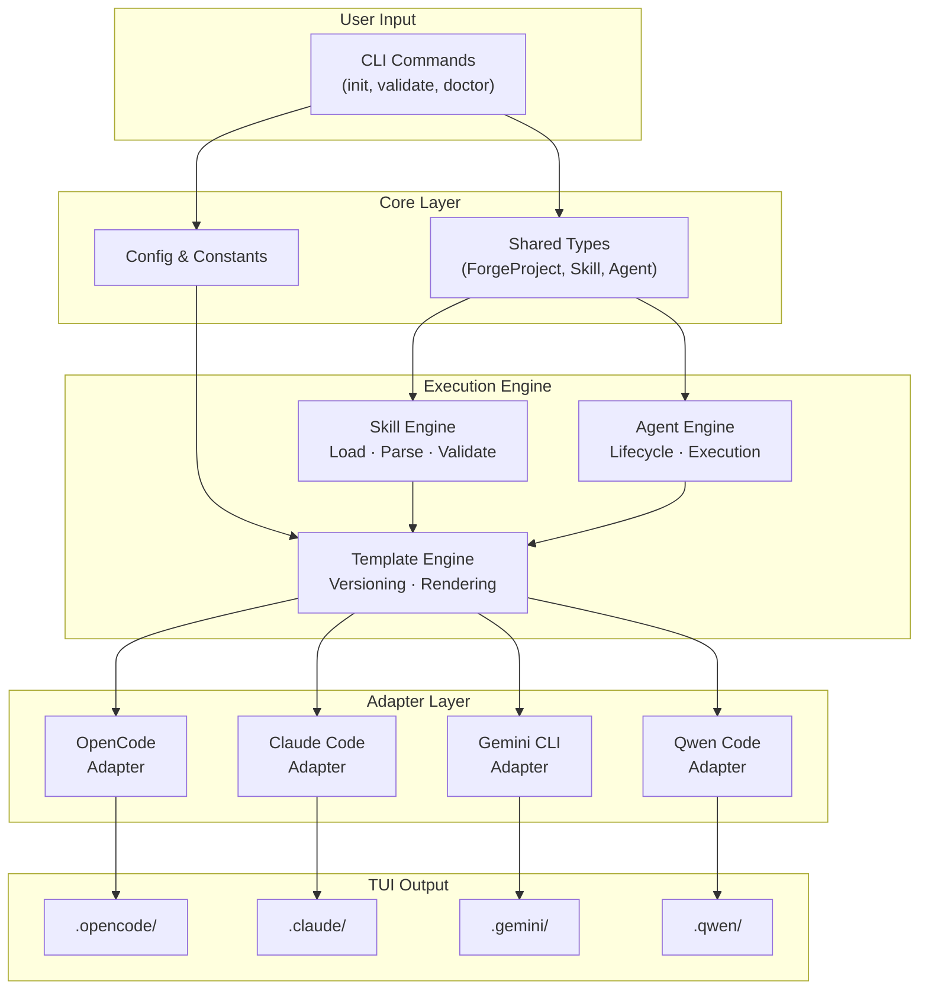
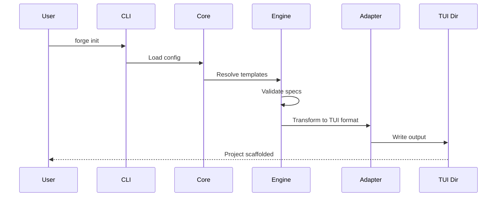
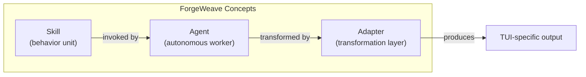
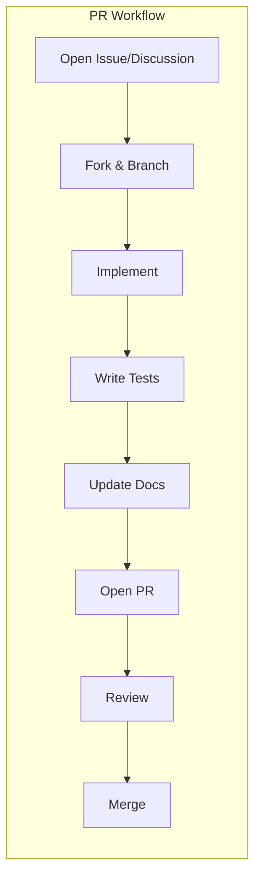

<p align="center">
  <picture>
    <source media="(prefers-color-scheme: dark)" srcset="https://img.shields.io/badge/ForgeWeave-v0.1.0--pre--release-blue?style=for-the-badge&logo=python&logoColor=white&labelColor=1a1a2e&color=00d4aa">
    
  </picture>
</p>

<p align="center">
  <a href="https://www.python.org/downloads/">
    
  </a>
  <a href="./LICENSE">
    
  </a>
  <a href="https://github.com/Razaib-khan/forgeweave/issues">
    
  </a>
  <a href="https://github.com/Razaib-khan/forgeweave/discussions">
    
  </a>
  <a href="./CONTRIBUTING.md">
    
  </a>
  <a href="./CODE_OF_CONDUCT.md">
    
  </a>
</p>

<h1 align="center">ForgeWeave</h1>
<p align="center"><em>A behavioral execution framework for AI agents inside development environments.</em></p>

<p align="center">
  Define, scaffold, and manage <strong>skills</strong> and <strong>agents</strong> across multiple TUI environments —
  OpenCode, Claude Code, Gemini CLI, and Qwen Code — using deterministic, documented specifications.
</p>

<br>

> **Status:** Early development (v0.1.0 pre-release). Specifications are stable and complete; the CLI and adapters are under active construction.

---

## Table of Contents

- [Why ForgeWeave?](#why-forgeweave)
- [Quick Start](#quick-start)
- [Architecture](#architecture)
- [Core Concepts](#core-concepts)
- [Documentation](#documentation)
- [Supported TUIs](#supported-tuis)
- [Project Structure](#project-structure)
- [Contributing](#contributing)
- [License](#license)
- [Contact](#contact)

---

## Why ForgeWeave?

AI coding agents are powerful, but they lack structure. Without explicit rules and documented behavior, agents become unpredictable, untestable, and hard to collaborate on.

ForgeWeave solves this by enforcing:

| Principle | What it means |
|---|---|
| **Determinism** | Same input always produces the same output. No randomness, no hidden branching. |
| **Explicitness** | All behavior must be documented. Undocumented behavior does not exist. |
| **Portability** | Skills and agents work across any supported TUI via adapter layers. |
| **Transparency** | No hidden state, no undocumented side effects, no agent-to-agent calls. |

> **TIP:** Read the [PROJECT_CONTEXT.md](./PROJECT_CONTEXT.md) for a deep dive into the design philosophy.

---

## Quick Start

```bash
# Install
pip install forgeweave

# Initialize a project for your TUI
forge init

# Verify your setup
forge doctor
```

> **NOTE:** The `forge doctor` command is not yet implemented. It will verify your environment in a future release.

---

## Architecture

ForgeWeave's architecture is layered. Each layer has a single responsibility, and data flows strictly downward through transformation boundaries.



### Data Flow



---

## Core Concepts



### Skills

A **skill** is a reusable, deterministic behavior unit — defined entirely in Markdown — that an agent can invoke to accomplish a specific task. Skills declare:

- Their **inputs** and **outputs** with full schemas
- **Execution steps** as atomic, ordered, verifiable actions
- **Decision rules** for conditional branching
- **Failure modes** with exact responses

> **SEE ALSO:** [SKILL_SPEC.md](./SKILL_SPEC.md) — the canonical format for all skills.

### Agents

An **agent** is an autonomous worker with a single defined role. Agents invoke skills, follow documented execution rules, and produce traceable outputs. Every agent has:

- A defined **role** and **goals**
- Explicit **tool access** permissions (deny-by-default)
- A **lifecycle** with initialization, execution, and stopping conditions
- **Error handling** for every failure mode

> **SEE ALSO:** [AGENT_SPEC.md](./AGENT_SPEC.md) — the canonical format for all agents.

### Adapters

An **adapter** is a stateless transformation layer that converts ForgeWeave's internal structures into the format expected by a specific TUI. Adapters are:

- **Transformation-only** — they convert, not compute
- **Idempotent** — running twice on the same input produces the same output
- **Non-mutating** — they never modify input objects

> **SEE ALSO:** [ADAPTER_SPEC.md](./ADAPTER_SPEC.md) — how adapters must be implemented.

---

## Documentation

| Document | Description |
|---|---|
| [SKILL_SPEC.md](./SKILL_SPEC.md) | Canonical format for all ForgeWeave skills |
| [AGENT_SPEC.md](./AGENT_SPEC.md) | Canonical format for all ForgeWeave agents |
| [ADAPTER_SPEC.md](./ADAPTER_SPEC.md) | TUI adapter implementation guide |
| [PROJECT_CONTEXT.md](./PROJECT_CONTEXT.md) | Architecture overview and design principles |
| [CONTRIBUTING.md](./CONTRIBUTING.md) | Contribution guide and development setup |
| [CHANGELOG.md](./CHANGELOG.md) | Release history and upcoming changes |
| [SECURITY.md](./SECURITY.md) | Security policy and vulnerability reporting |
| [CODE_OF_CONDUCT.md](./CODE_OF_CONDUCT.md) | Community standards and enforcement |
| [AGENTS.md](./AGENTS.md) | Project-level agent registration config |

---

## Supported TUIs

| TUI | Adapter | Status | Target Output Dir |
|---|---|---|---|
| OpenCode | `OpenCodeAdapter` |  | `.opencode/` |
| Claude Code | `ClaudeAdapter` |  | `.claude/` |
| Gemini CLI | `GeminiAdapter` |  | `.gemini/` |
| Qwen Code | `QwenAdapter` |  | `.qwen/` |

---

## Project Structure

```
forgeweave/
├── forgeweave/               # Core Python package
│   ├── cli/                  # CLI entry points and commands
│   ├── adapters/             # TUI transformation layers
│   ├── skills/               # Skill loading, parsing, validation
│   ├── agents/               # Agent lifecycle and execution
│   ├── templates/            # Template engine and versioning
│   ├── hooks/                # Lifecycle hook system (future)
│   ├── mcp/                  # MCP integration (future)
│   └── core/                 # Shared types, config, constants
├── forgeweave/Templates/     # TUI template blueprints
├── .github/                  # Issue templates and PR template
├── tests/                    # Unit and integration tests
├── AGENT_SPEC.md             # Agent specification
├── AGENTS.md                 # Agent registration config
├── SKILL_SPEC.md             # Skill specification
├── ADAPTER_SPEC.md           # Adapter specification
├── PROJECT_CONTEXT.md        # Architecture documentation
├── CONTRIBUTING.md           # Contributor guide
├── CODE_OF_CONDUCT.md        # Community standards
├── SECURITY.md               # Security policy
├── CHANGELOG.md              # Release history
├── pyproject.toml             # Package configuration
└── README.md                 # This file
```

---

## Contributing

We welcome contributions of all kinds — bug fixes, new features, adapters, skills, agents, and documentation.



Before you start, please read:

1. [CONTRIBUTING.md](./CONTRIBUTING.md) — full development setup and PR process
2. [CODE_OF_CONDUCT.md](./CODE_OF_CONDUCT.md) — community standards

All contributions must follow:
- **Conventional Commits** for commit messages
- **Trunk-based development** (feature branches from `dev`)
- **80%+ test coverage** for new code
- **Spec compliance** for any skill or agent changes

---

## License

ForgeWeave is open source under the [MIT License](./LICENSE).

---

## Contact

- **Issues:** [GitHub Issues](https://github.com/Razaib-khan/forgeweave/issues)
- **Discussions:** [GitHub Discussions](https://github.com/Razaib-khan/forgeweave/discussions)
- **Security:** [razaibkhanofficial@gmail.com](mailto:razaibkhanofficial@gmail.com)

---

<p align="center">
  <sub>Built with ❤️ by the ForgeWeave community.</sub>
  <br>
  <sub>ForgeWeave is not affiliated with OpenCode, Claude, Gemini, or Qwen.</sub>
</p>
