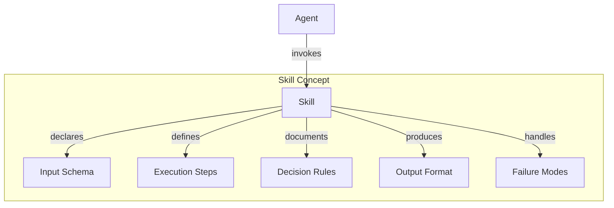
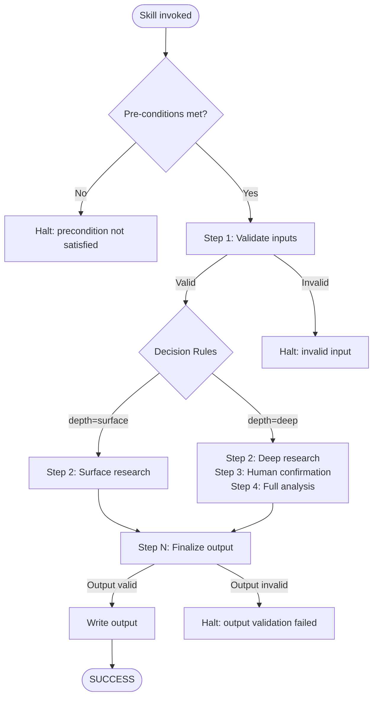
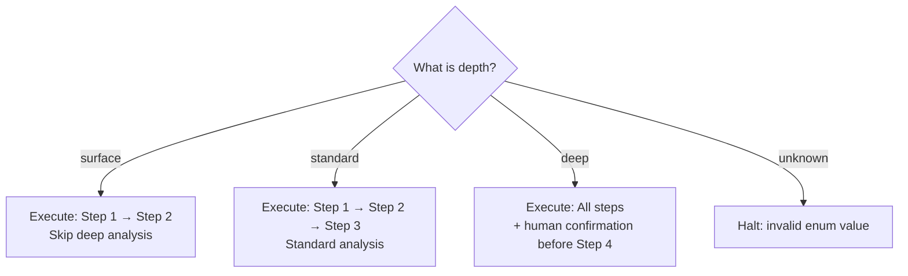
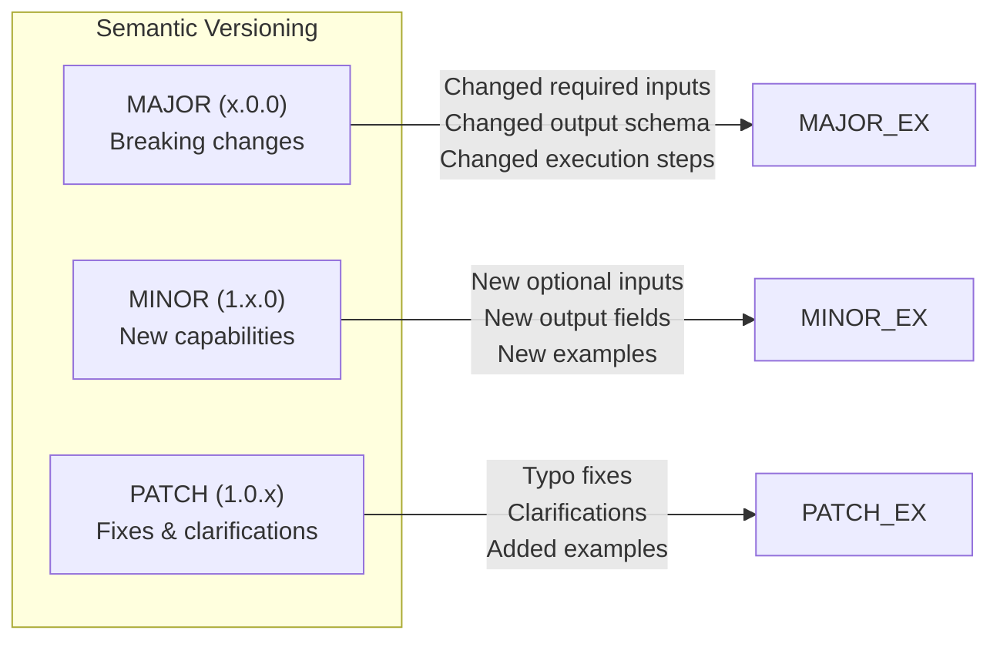
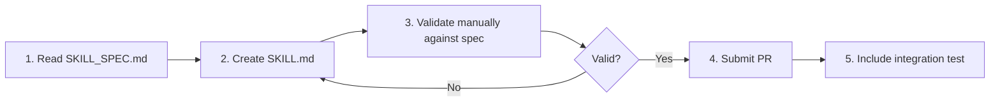

# Skill Specification Standard

**Version:** 1.0
**Status:** Active
**Last updated:** 2026-06-22

> **v2 Note:** ForgeWeave 2.0 generates SKILL.md files as TUI-consumed templates. There is no runtime Skill Engine — skills are loaded and invoked by the TUI (OpenCode, Claude Code, etc.). This spec defines the canonical format that all SKILL.md files must follow for compatibility across TUIs.

This document defines the canonical format for all ForgeWeave skills. Every skill — whether built-in, community-contributed, or user-generated — must conform to this specification exactly.

> **CAUTION:** Deviations will cause skill loading to fail in TUI runners. Validation is strict by design to guarantee determinism.

---

## Table of Contents

- [What is a Skill?](#what-is-a-skill)
- [File Location](#file-location)
- [Naming Conventions](#naming-conventions)
- [Complete SKILL.md Template](#complete-skillmd-template)
- [Decision Rules](#decision-rules)
- [Execution Flow](#execution-flow)
- [Validation Rules](#validation-rules)
- [Versioning Skills](#versioning-skills)
- [Submitting a New Skill](#submitting-a-new-skill)

---

## What is a Skill?

A Skill is a **reusable, deterministic behavior unit** that an agent can invoke to accomplish a specific task.



### Skill Characteristics

| Property | Description |
|---|---|
| **Declarative** | Defined in Markdown, not code |
| **Stateless** | Does not store execution history internally |
| **Portable** | Usable across different TUI adapters |
| **Composable** | Agents can chain multiple skills |

### What a Skill Is NOT

- **Not a code module** — skills are Markdown specifications
- **Not an agent definition** — agents invoke skills
- **Not a command definition** — commands trigger agents, not skills
- **Not a configuration file** — skills define behavior, not settings

---

## File Location

Every skill file must be placed at:

```
templates/<tui-name>/skills/<skill-name>/SKILL.md
```

### Examples

| TUI | Path |
|---|---|
| OpenCode | `templates/opencode/skills/deep-research/SKILL.md` |
| Claude Code | `templates/claude/skills/code-review/SKILL.md` |
| Gemini CLI | `templates/gemini/skills/architecture-planning/SKILL.md` |
| Qwen Code | `templates/qwen/skills/documentation-generation/SKILL.md` |

---

## Naming Conventions

| Element | Convention | Example |
|---|---|---|
| Directory name | `kebab-case` | `deep-research` |
| File name | Always `SKILL.md` | `SKILL.md` |
| Skill name in frontmatter | `Title Case` | `Deep Research` |
| Skill ID in frontmatter | `kebab-case` | `deep-research` |

---

## Complete SKILL.md Template

Every SKILL.md must contain all sections listed below, in this exact order.

```markdown
---
skill_id: <kebab-case-id>
name: <Human Readable Name>
version: <semver, e.g. 1.0.0>
description: <One sentence. What this skill does and why it exists.>
author: <GitHub username or "ForgeWeave Core">
tui_compatibility:
  - opencode
  - claude
  - gemini
  - qwen
tags:
  - <tag>
  - <tag>
---

# <Skill Name>

## Purpose

2-4 sentences. Explain:
- What problem does this skill solve?
- When should an agent invoke this skill?
- What is out of scope for this skill?

## Trigger Conditions

Define exactly when this skill should be activated.
Use precise, testable conditions — not vague intent.

Format: a numbered list of conditions.
If ANY condition is met, the skill may be triggered.
If ALL conditions must be met, say so explicitly.

1. Condition one.
2. Condition two.

## Pre-conditions

What must be true BEFORE this skill can execute?
If pre-conditions are not met, the skill must STOP and report why.

- [ ] Pre-condition one
- [ ] Pre-condition two

## Inputs

Declare all inputs this skill expects.
For each input: name, type, required/optional, description.

| Input | Type | Required | Description |
|---|---|---|---|
| `topic` | string | Yes | The subject to research |
| `depth` | enum: `surface`, `standard`, `deep` | No (default: `standard`) | Research depth level |

## Execution Steps

The exact ordered steps the agent must follow.
Steps must be deterministic — no "try this or that" branching without explicit decision rules.
Each step should be atomic and verifiable.

### Step 1: Validate Inputs

1. Confirm all required inputs are present.
2. Confirm all enum inputs contain valid values.
3. If validation fails: stop execution, report which input failed and why.

### Step 2: <Step Name>

1. Sub-step one.
2. Sub-step two.

### Step N: Finalize Output

1. Validate output against the Output Format section.
2. Write output to the declared output location.
3. Report completion status.

## Decision Rules

If the skill has conditional branching, document every branch here.

- IF `depth` is `surface`: execute only Step 1 and Step 2.
- IF `depth` is `deep`: execute all steps plus request human confirmation before Step 4.
- IF any step fails: stop execution immediately and invoke the Failure Handling section.

## Output Format

### Output Location

```
./<tui>/<skill-id>/output/<timestamp>-<input-slug>.md
```

### Output Schema

```
# <Skill Name> Result

**Input:** <input summary>
**Executed at:** <ISO 8601 timestamp>
**Depth:** <depth value>
**Status:** SUCCESS | PARTIAL | FAILED

## Summary

<2-3 sentence summary of findings>

## Details

<Full structured output>

## Sources

<List of sources consulted, if applicable>
```

## Failure Handling

| Failure Condition | Response |
|---|---|
| Required input missing | Stop. Report: `"Skill <skill-id> requires input '<input-name>' which was not provided."` |
| Pre-condition not met | Stop. Report: `"Pre-condition '<condition>' not satisfied. Cannot execute."` |
| Step execution error | Stop. Report step number, error message, and current state. |
| Output validation failure | Stop. Report: `"Output validation failed: <reason>. Raw output preserved at <path>."` |

## Constraints

- This skill must not make external network requests without explicit user configuration.
- This skill must not modify files outside the project directory.
- This skill must not store state between invocations.
- Execution time must not exceed <X> seconds without reporting a progress update.

## Examples

### Example 1: Standard Research

**Input:**
```json
{
  "topic": "MCP protocol specification",
  "depth": "standard"
}
```

**Expected Output:**
```markdown
# Deep Research Result

**Input:** MCP protocol specification
**Executed at:** 2026-01-15T09:30:00Z
**Depth:** standard
**Status:** SUCCESS

## Summary

The MCP (Model Context Protocol) is an open standard developed by Anthropic...
```

## Changelog

| Version | Change |
|---|---|
| 1.0.0 | Initial version |
```

---

## Execution Flow



### Decision Tree



> **RULE:** No undocumented branching allowed. Every decision path must be declared in the Decision Rules section.

---

## Validation Rules

The ForgeWeave skill validator checks the following at load time:

| Rule | Behavior on failure |
|---|---|
| `skill_id` matches directory name | Hard error — skill will not load |
| All required frontmatter fields present | Hard error |
| All required sections present | Hard error |
| `tui_compatibility` is not empty | Hard error |
| `version` follows semver | Warning — skill loads with degraded status |
| Examples section is not empty | Warning |
| Output format section defines a schema | Warning |

> **WARNING:** Hard errors prevent the skill from loading. Warnings allow loading but flag potential issues for review.

---

## Versioning Skills

Skills follow semantic versioning independently of the ForgeWeave CLI:



| Bump | When | Example |
|---|---|---|
| **PATCH** (1.0.x) | Typo fixes, clarifications, added examples | `1.0.0` → `1.0.1` |
| **MINOR** (1.x.0) | New optional inputs, new output fields, new examples | `1.0.0` → `1.1.0` |
| **MAJOR** (x.0.0) | Changed required inputs, changed output schema, changed execution steps in a breaking way | `1.0.0` → `2.0.0` |

> **NOTE:** When a skill's major version is incremented, the previous major version must remain in the templates directory as `<skill-id>-v<N>/` until the next major ForgeWeave release.

---

## Submitting a New Skill



1. Read this entire specification.
2. Create the skill in the appropriate template directory.
3. Validate your SKILL.md manually against the Validation Rules table above. *(A `forge validate` command is planned for a future release.)*
4. Submit a PR following the [CONTRIBUTING.md](./CONTRIBUTING.md) process.
5. PR must include at least one integration test that loads and validates the skill.

Community-contributed skills are placed in `templates/community/<tui>/skills/` and labeled as community-maintained.
