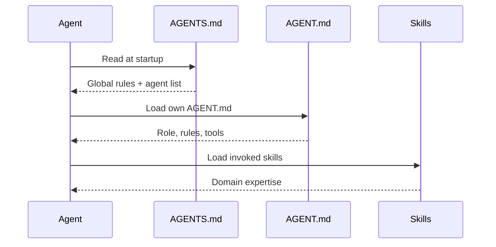

# AGENTS.md

**Version:** 2.0
**Last updated:** 2026-06-20
**Status:** Active

This file is loaded by every agent at initialization time. It defines the project's agent registry AND provides global behavioral rules that all coding agents must follow.

> **IMPORTANT:** Agents must not modify this file directly. Configuration changes must go through the `forge` CLI or a maintainer-approved PR.

---

## Table of Contents

- [Global Rules for All Agents](#global-rules-for-all-agents)
- [Working with ForgeWeave](#working-with-forgeweave)
- [Usage of Skills](#usage-of-skills)
- [Usage of Subagents](#usage-of-subagents)
- [Usage of MCP Servers](#usage-of-mcp-servers)
- [Agent Registry](#agent-registry)
- [Validation Rules](#validation-rules)

---

## Global Rules for All Agents

These rules apply to EVERY agent operating in this project, regardless of role:

1. **Read AGENTS.md first** — Before any task, read this file to understand project conventions and available agents/skills.
2. **Use skills** — Always check available skills before writing code from scratch. Load the matching skill and follow its instructions.
3. **Use subagents** — Delegate complex, independent work to subagents. Do not do everything yourself.
4. **Use MCP servers** — Prefer Playwright MCP tools (`browser_*`) over raw bash/subprocess for browser automation. Use Headroom MCP (`headroom_compress`) to reduce token costs on large tool outputs before sending to the LLM.
5. **No hallucination** — Every claim about external APIs, libraries, or tools must come from a loaded skill, MCP tool output, Context7 documentation, or official documentation.
6. **Skill-builder is mandatory** — When you learn a repeatable pattern, create a skill for it using the skill-builder skill. Skills are the project's collective knowledge.

---

## Working with ForgeWeave

ForgeWeave provides a complete agent orchestration framework. Every coding agent operates within this system:

### The Playwright MCP Server

Playwright MCP (`npx @playwright/mcp@latest`) provides browser automation tools. All web interaction tasks use Playwright MCP tools:

- `browser_navigate` — load a page
- `browser_snapshot` — capture page state as accessibility tree
- `browser_click` — click elements  
- `browser_type` — type into fields
- `browser_fill_form` — fill multiple form fields
- `browser_take_screenshot` — capture screenshots
- `browser_console_messages` — read console output
- `browser_network_requests` — inspect network traffic

### Loading Context

Before modifying code, read AGENTS.md, AGENT.md files, skill SKILL.md files, and command definitions to understand project rules, conventions, and available capabilities.

### The Research Pipeline

The `/forge-research` command runs the deep-research skill's 6-stage pipeline:

1. **Plan** — Decompose topic into subtopics with seed URLs
2. **Research (parallel)** — Crawl URLs, extract code examples
3. **Validate** — Cross-check claims, remove hallucinations
4. **Synthesize** — Merge into structured report
5. **Raw Output** — Save unformatted scraped data to `research/<slug>-raw/*.md`
6. **Skill Conversion** — Convert raw findings into a reusable skill via the skill-builder skill

The final output of any research is BOTH a report AND a skill that encodes the findings for future use.

### Project Lifecycle

```
forge init → load skills → research → code → build skills → commit
```

Skills created via research become part of the project's collective intelligence, making future coding faster and more accurate.

---

## Research Auto-Detection System

Agents must automatically decide between single search and deep research based on context. This is NOT optional — agents must proactively detect when they lack context and trigger the appropriate level of research.

### Single Search (`websearch` or `/forge-search`)

**Use when:**
- You are about to write code using an API or library you're not 100% confident about
- You encounter an unfamiliar function signature, parameter, or return type
- You need to verify a library version, feature availability, or deprecation status
- You need a quick code example for a specific API method
- You encounter an error and need to look up the error message or fix
- You need to confirm a configuration option, CLI flag, or environment variable
- The question can be answered from 1-3 sources
- You are short on context for any technology usage — **stop and search before coding**

**How it works:**
```
Agent lacks context about an API/tool → use websearch tool → 
extract answer from top results → proceed with confidence
```

### Deep Research (`/forge-research`)

**Use when:**
- You need to understand a new framework, library, or tool from scratch
- The topic requires comprehensive understanding with 3+ subtopics
- You need to compare multiple approaches, libraries, or versions
- You need to produce a reusable skill for future coding (skill-builder output)
- The topic requires cross-referencing multiple authoritative sources
- You need a structured report with code examples, best practices, and edge cases
- The question cannot be answered by any single source or quick lookup
- You encounter a repeatable pattern that the project will need again → research → convert to skill
- You encounter a task that would benefit from a specialized subagent or reusable skill — delegate to a subagent with the necessary skills and use the skill-builder skill to encode the pattern
- The agent determines that creating a dedicated skill + subagent would be more efficient than one-off research

**How it works:**
```
Agent encounters complex/novel topic → run /forge-research command →
6-stage pipeline produces report + skill → use skill for future coding
```

### `/forge-research` Flags

The `/forge-research` command accepts positional flags to control output formatting and skill generation:

| Flag | Effect |
|---|---|
| `formatted` | (default) Produce a well-organized, structured markdown report with sections, code examples, and citations |
| `unformatted` | Produce raw scraped output only — one markdown file per source URL with minimal processing |
| `skill` | (default) Also generate a reusable SKILL.md from the findings (placed in `.opencode/skills/<topic>/`) |
| `no-skill` | Skip skill generation — report only |

**Default behavior** (no flags): `formatted` + `skill` — both a structured report and a reusable skill.

**Examples:**
```
/forge-research Next.js 16 caching --depth=deep formed
/forge-research Next.js 16 caching unformatted no-skill
/forge-research Python 3.14 pattern matching formated no-skill
/forge-research React Server Components formated skill
```

### Subagent + Skill Auto-Detection

When the agent determines that the task requires:
- A **specialized workflow** that would benefit from a dedicated skill
- A **subagent with domain expertise** that doesn't yet exist
- A **repeatable pattern** that will be needed again

The agent should:
1. Recognize the opportunity and determine what skill/subagent to create
2. Spawn a subagent using the `task` tool, instructing it to:
   a. Perform the necessary research or work
   b. Use the `skill-builder` skill to create a reusable skill
   c. Optionally create a specialized AGENT.md for a subagent
3. Validate the output and register the new skill/agent for future use

### Quick Decision Matrix

| Situation | Action |
|---|---|
| You don't know a specific API parameter | `websearch` — quick lookup |
| Error message you haven't seen before | `websearch` — find the fix |
| Need to write code with an unfamiliar library | `websearch` — check signatures first |
| Need to compare React Server Actions vs tRPC | `/forge-research` — full comparison |
| Learning Next.js 16 caching from scratch | `/forge-research` — comprehensive guide |
| Need to create a reusable skill for the project | `/forge-research` — produces skill automatically |
| Not sure how a CLI flag works | `websearch` — quick doc check |
| Whole new domain (auth, deployment, testing) | `/forge-research` — structured understanding |

### Trigger Rule

**When in doubt about ANY technology usage, ALWAYS search first.** Do not guess API signatures, import paths, configuration options, or error fixes. Use `websearch` as your default fallback for any context gap. Use `/forge-research` only when the topic is large enough that a single lookup won't suffice.

### Explicit Override Rule

**When the user explicitly uses a forge command (`/forge-search` or `/forge-research`), execute it regardless of auto-detection.** The user's explicit command overrides all auto-detection logic. Do not second-guess, downgrade, or upgrade the research level — just run the command as specified. This ensures the user can always force a single search or deep research regardless of your context assessment.

---

## Usage of Skills

Skills are the primary mechanism for encoding domain expertise. They are loaded on demand and provide step-by-step workflows, gotchas, and reference material.

### How to Use Skills

1. **Check available skills** — Look in `.opencode/skills/` (or equivalent for your TUI) for skills matching your task.
2. **Load the matching skill** — Read the skill's SKILL.md file and follow its instructions.
3. **Follow the skill's instructions** — Skills contain workflows, decision trees, and gotchas specific to the domain.
4. **Update skills when you learn something** — Use the skill-builder skill to improve existing skills with new patterns you discover.

### When to Create a Skill

- After completing a `/forge-research` pipeline — the research is automatically converted into a skill
- When you discover a repeatable pattern that took significant effort to get right
- When you encounter an error or edge case that isn't documented anywhere
- When configuring a new tool, library, or framework for the project

### Key Skills Available

| Skill | Purpose | Trigger |
|---|---|---|
| `skill-builder` | Design, write, test, and iterate on skills | Creating or improving any skill |
| `playwright-mcp` | Browser automation via Playwright MCP | Any web interaction task |
| `headroom-mcp` | Context compression via Headroom MCP | Token reduction, compression, retrieval |
| `firecrawl-mcp` | Web search, scrape, crawl, and extraction via Firecrawl | Web research, scraping, data extraction |
| `github-mcp` | GitHub repository management | Issues, PRs, repo search, file access |
| `sqlite-mcp` | SQLite database query and manipulation | Database queries, schema inspection |
| `context7-mcp` | Library/framework documentation lookup | API docs, library usage, code examples |
| `deep-research` | Multi-stage research pipeline | `/forge-research` command |
| `web-research` | Fetch and extract from live web pages | URL fetching |
| `quick-research` | Fast single-pass research | Simple factual questions |
| `architecture-designer` | Design system architecture | Architecture decisions |
| `code-builder` | Scaffold new modules | New feature work |
| `test-generator` | Generate and run tests | Testing tasks |
| `refactor-engine` | Refactor existing code | Code improvement |
| `debugger` | Debugging methodology | Bug fixing |
| `validation-engine` | Validate outputs | Quality assurance |

### Skill File Layout

Every skill follows this structure:
```
skill-name/
├── SKILL.md           ← Core instructions (always read this)
├── references/        ← Deep dives, sub-guides
├── scripts/           ← Helper scripts
└── evals/             ← Test prompts
```

---

## Usage of Subagents

Subagents are autonomous agents you can spawn for parallel, independent work. They have their own AGENT.md specification and tool access.

### When to Use Subagents

| Scenario | Why Subagent |
|---|---|
| Researching multiple subtopics simultaneously | Parallel crawling saves time |
| Running tests while coding | No wait time — both proceed in parallel |
| Validating output while writing the next feature | Independent validation catches errors |
| Investigating a complex error from multiple angles | Decompose the problem space |
| Generating multiple file scaffolds | Each is independent |
| Reviewing code while you implement | Parallel review speeds up iteration |

### How to Spawn a Subagent

Use the `task` tool to spawn a subagent with the subagent's role description and a detailed task prompt. The task tool creates an autonomous agent that handles the work independently.

### Subagent Rules

1. **One job per subagent** — Each subagent has a single, well-defined task
2. **Parallel when possible** — Independent tasks should always run in parallel
3. **Collect results** — The subagent returns its results as a message when done
4. **Validate independently** — Don't trust subagent output blindly; validate it
5. **Report progress** — Subagents should report their progress via chat messages during execution

---

## Usage of MCP Servers

ForgeWeave operates alongside multiple MCP servers. Each provides a different set of tools.

### Available MCP Servers

| Server | Tools Provided | Purpose |
|---|---|---|
| `playwright` (Playwright MCP) *mandatory* | `browser_navigate`, `browser_snapshot`, `browser_click`, `browser_type`, `browser_fill_form`, `browser_take_screenshot`, `browser_console_messages`, `browser_network_requests`, `browser_wait_for` | Browser automation, JS-rendered content |
| `headroom` (Headroom MCP) *mandatory* | `headroom_compress`, `headroom_retrieve`, `headroom_stats` | Context compression — 60-95% fewer tokens, reversible |
| `firecrawl` (Firecrawl MCP) | `firecrawl_search`, `firecrawl_scrape`, `firecrawl_crawl`, `firecrawl_extract`, `firecrawl_agent` | Web search, scraping, crawling, extraction |
| `github` (GitHub MCP) | `github_list_issues`, `github_create_issue`, `github_search_repos`, `github_get_file`, `github_create_pr` | GitHub repo management, issues, PRs |
| `sqlite` (SQLite MCP) | `sqlite_query`, `sqlite_execute`, `sqlite_list_tables`, `sqlite_describe_table` | SQLite database interaction |
| `context7` (Context7 MCP) | `resolve-library-id`, `query-docs` (or `context7_resolve-library-id`, `context7_query-docs` when built-in) | Library/framework documentation lookup |

### How to Use MCP Tools

MCP tools are available when the respective server is running. Call them by their tool name directly:
- **Playwright MCP**: `browser_navigate`, `browser_snapshot`, `browser_click`, etc.
- **Headroom MCP**: `headroom_compress`, `headroom_retrieve`, `headroom_stats`
- **Firecrawl MCP**: `firecrawl_search`, `firecrawl_scrape`, `firecrawl_crawl`, etc.
- **GitHub MCP**: `github_list_issues`, `github_create_pr`, `github_search_repos`, etc.
- **SQLite MCP**: `sqlite_query`, `sqlite_execute`, `sqlite_list_tables`, etc.
- **Context7 MCP**: `resolve-library-id` + `query-docs` (or `context7_resolve-library-id` + `context7_query-docs` when built-in)

Prefer MCP tools over bash — they provide structured, context-aware results that agents can reason about.

### When to Use Each Server

| Task | Tool |
|---|---|
| Search the web | `websearch` tool or Firecrawl MCP: `firecrawl_search` |
| Research a topic | `/forge-research` command |
| Read a URL | `webfetch` tool or Firecrawl MCP: `firecrawl_scrape` |
| Browse a JS-rendered page | Playwright MCP: `browser_navigate` + `browser_snapshot` |
| Fill a form / click a button | Playwright MCP: `browser_click`, `browser_type`, `browser_fill_form` |
| Take a screenshot | Playwright MCP: `browser_take_screenshot` |
| Compress context / reduce tokens | Headroom MCP: `headroom_compress` |
| Retrieve original (uncompressed) context | Headroom MCP: `headroom_retrieve` |
| Check compression savings | Headroom MCP: `headroom_stats` |
| Create a skill | `skill-builder` skill instructions |
| Manage GitHub issues / PRs | GitHub MCP: `github_list_issues`, `github_create_pr` |
| Query a database | SQLite MCP: `sqlite_query`, `sqlite_execute` |
| Look up library/framework docs | Context7 MCP: `resolve-library-id` + `query-docs` |

---

## Agent Registry

Agents are registered here for lifecycle management.

```yaml
agents: []
```

> Agents are defined per-project via `forge init`. Run `forge init --tui <tui>` to register the default set.

---

## How It Works



Every agent reads this file during initialization. The file provides:

- Global behavioral rules for working in this project
- Which agents are available
- Where to find each agent's `AGENT.md` specification
- Whether each agent is currently enabled

---

## Format

Agents are registered in YAML format:

```yaml
agents:
  - id: <agent-id>
    path: <relative-path-to-AGENT.md>
    enabled: true | false
```

### Field Reference

| Field | Type | Required | Description |
|---|---|---|---|
| `id` | string | Yes | Agent ID, must match `agent_id` in the AGENT.md frontmatter |
| `path` | string | Yes | Relative path from project root to the agent's `AGENT.md` file |
| `enabled` | boolean | Yes | Whether this agent is active. `false` means the agent exists but will not be loaded |

---

## Validation Rules

The following checks are performed when this file is loaded:

| Rule | Behavior on failure |
|---|---|
| File exists and is valid YAML | Hard error — agent loading halts |
| All required fields present (`id`, `path`, `enabled`) | Hard error |
| `id` matches an existing AGENT.md `agent_id` | Hard error |
| `path` points to an existing file | Hard error |
| No duplicate agent IDs | Hard error |
| `enabled` is a boolean | Warning — treats as `false` |

---

## Quick Reference Card

**Always do:**
1. Read this file first on every new task
2. Check available skills before coding
3. Use subagents for parallel work
4. Use MCP tools over bash
5. Convert research findings into skills
6. Read AGENTS.md and relevant skill files before editing

**Never do:**
1. Write code that duplicates an existing skill's instructions
2. Keep research findings without persistence — convert patterns to skills and create subagents for repeatable workflows
3. Work without loading relevant context/AGENTs first
4. Ignore available Playwright MCP tools in favor of raw subprocess calls
